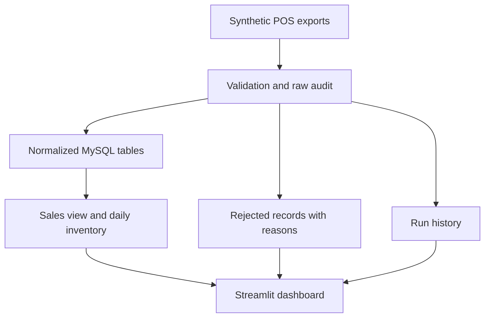

# Liquor Store Sales & Inventory Analytics

An end-to-end retail portfolio project: reproducible synthetic data, a validated Python/MySQL batch pipeline, SQL analytics, and an interactive Streamlit dashboard.

**Business question:** Which products generate gross profit, when is the store busiest, and where should the owner replenish or reduce inventory?

> All businesses, products, transactions, and findings are simulated. This is a local educational application, not a production point-of-sale system.

## What this demonstrates

| Data engineering | Data analysis |
|---|---|
| Relational schema, keys, constraints and indexes | Net sales, gross profit and weighted gross margin |
| Raw record audit with rejection reasons | Daily trends and category/product comparisons |
| Idempotent batch loading and immutable source IDs | Receipt counts by weekday and hour |
| Transaction rollback and run history | Stock balances and heuristic reorder points |
| Append-only incremental inserts | Slow-moving stock and inventory value |
| Reproducible data generation and automated tests | Filters and downloadable underlying records |

**Stack:** Python 3.12+, MySQL 8.0.16+, SQLAlchemy, pandas, Plotly, Streamlit, pytest. SQLite is included for a zero-server demo. Python 3.12 is the reference runtime.

## Quick start: run the demo on your Mac

No MySQL setup or password is required for this mode. In Terminal:

```bash
git clone https://github.com/Sraj1s/liquor_store_analytic.git
cd liquor_store_analytic
python3 -m venv .venv
source .venv/bin/activate
python -m pip install -r requirements.txt
python -m pip install -e . --no-deps
liquor generate
liquor init --demo
liquor load --demo
LIQUOR_DEMO=1 streamlit run dashboard/app.py
```

Open the local address printed by Streamlit, normally `http://localhost:8501`. Stop with **Control+C**. If you already cloned the repository, use that folder instead of cloning again. The generator refuses to overwrite a nonempty output folder; after the first setup, simply activate the environment and launch the dashboard again.

## Use your MySQL server

1. Connect to your local server in MySQL Workbench. Execute `sql/create_database.sql` after replacing its example password **locally**. It creates a dedicated database and application user. Do not commit a real password. If that user already exists, use its existing password or manage it in Workbench; `CREATE USER IF NOT EXISTS` does not change it.
2. Copy the configuration:

   ```bash
   cp .env.example .env
   ```

3. Edit `.env` with your local host, port, database, username and password. No URL encoding is needed for passwords; the application builds the connection URL safely. Quote dotenv values containing `#` or spaces. `.env` is ignored by Git.
4. With the same Python environment activated, run:

   ```bash
   liquor init
   liquor generate  # skip if data/raw/base already exists
   liquor load
   streamlit run dashboard/app.py
   ```

   Do not set `LIQUOR_DEMO=1` for the MySQL dashboard. If previously exported, run `unset LIQUOR_DEMO` first.

`liquor init` creates the relational tables, indexes and `fact_sales` SQL view without dropping business tables. The MySQL reference DDL is in `sql/schema_mysql.sql`; normally use the CLI installer rather than manually running the DDL. The application uses only the configured project database.

## Explore the dashboard

- **Sales & profitability:** net sales, gross profit, gross margin, receipt count, daily trend, category comparison, top products, and weekday/hour heatmap.
- **Inventory decisions:** end-of-day units, catalog-cost stock value, a restocking queue and slow-moving inventory.
- **Pipeline health:** all run outcomes and quarantined rows with their original payloads.

Date and category filters apply to sales. Inventory uses the selected **end date** plus category and a trailing demand window; the sales start date does not shorten that window. Pipeline health is global. CSV downloads use the same filtered data as their corresponding views.

## Run the engineering demonstration

Load the same batch again:

```bash
liquor load --demo
```

The outcome is `skipped`; totals do not increase. MySQL users omit `--demo` throughout.

Generate an extended snapshot with one additional day and load it:

```bash
liquor generate --days 184 --output data/raw/extended
liquor load --demo --input data/raw/extended
liquor export-rejects --demo
```

Existing identical IDs are counted as duplicates; only new IDs are inserted. This is **incremental loading from full CSV snapshots**, not change-data capture or incremental extraction. The compact daily inventory mart is rebuilt transactionally on every accepted batch. A changed existing ID is quarantined rather than silently overwritten. Run one writer at a time.

The base dataset uses seed 42 and March 1–August 30, 2026: 100 products, five suppliers, 8,430 receipts and 16,926 valid sale items. Its exports intentionally include five repeated sale items and three invalid rows (unknown product, negative quantity and excessive discount). The first load reads 26,292 rows across five files: **26,284 inserted, five duplicates and three rejected**.

Read [computed results from the default dataset](docs/demo-results.md) for a reproducible example of the analysis.

## Architecture and design

The generator creates simulated POS and inventory CSV exports. The pipeline preserves raw rows, cleans and validates them, then stores them in normalized MySQL tables. Analytics are queried from those tables; daily inventory is derived from movements minus sales. See [architecture and data contracts](docs/architecture.md).



This project uses CSV exports as the ingestion boundary rather than requiring a second live operational database. All accepted records live in MySQL for SQL analysis.

## Tests and debugging

```bash
python -m pytest -q
```

The default suite uses temporary SQLite databases and Streamlit's AppTest. It checks monetary reconciliation, duplicate protection across identical and reordered snapshots, incremental inserts, invalid-record quarantine, conflicting IDs, negative-stock rollback/retry, deterministic generation, inventory arithmetic and dashboard filters. The live MySQL test is skipped unless explicitly enabled.

GitHub Actions provisions a disposable MySQL 8.0 database and runs the suite with the MySQL integration test enabled. Never run that integration test against your working dataset: it requires a database ending in `_test` and removes its project tables during setup/cleanup. See [verification](docs/verification.md) for observed results and [troubleshooting](docs/troubleshooting.md) for setup problems.

## Learn the project

Start with [the walkthrough](docs/walkthrough.md), then read these in order:

1. `src/liquor/schema.py` — table relationships and the analytical sales view.
2. `src/liquor/generate.py` — business simulation and intentional data defects.
3. `src/liquor/pipeline.py` — raw audit, validation, idempotency and transactions.
4. `sql/business_questions.sql` — SQL aggregations and window-function ranking.
5. `src/liquor/analytics.py` and `dashboard/app.py` — metrics and presentation.
6. `tests/` — examples of the guarantees the pipeline must preserve.

## Scope and limitations

- Fixed catalog costs, no FIFO/weighted-average accounting, tax, returns, payment settlement, customers or operating expenses. Gross profit is **not** net profit.
- Delivery simulation is simplified; supplier lead time affects the reorder heuristic, not a full purchasing simulation. Sales during stockouts are unobserved, so recent sales can understate demand.
- Inventory validation is at day end, not intraday. Reordering uses average recent units/day and three buffer days; it ignores open purchase orders.
- Source entities are immutable after insertion. Corrections, schema migrations, concurrent writers, orchestration, authentication and cloud hosting are future work.
- This is a small batch workload. The pipeline reads each export into memory and refreshes all daily inventory snapshots; it is not a distributed or large-scale streaming system.

Built with AI assistance. The walkthrough and tests make the implementation inspectable; understand and reproduce it before presenting it as a portfolio project.
