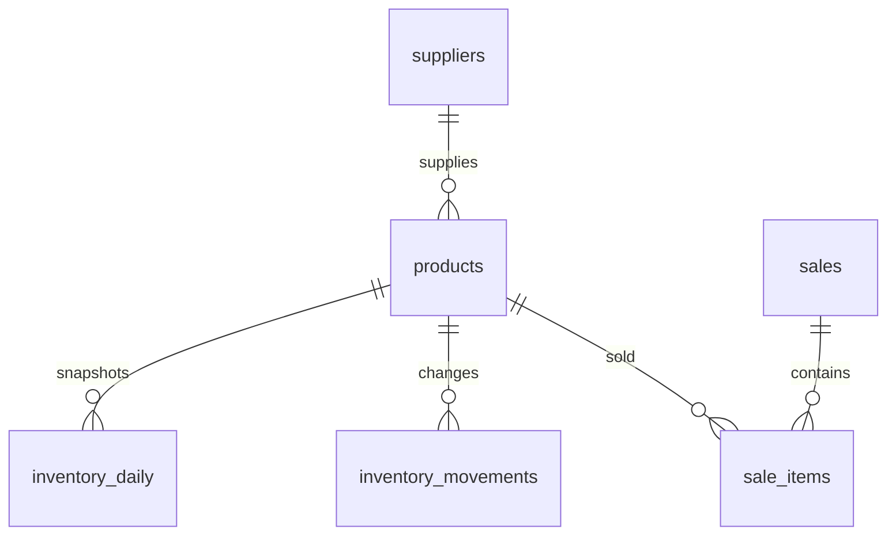

# Architecture and data contracts

## Layers

| Layer | Storage | Grain and purpose |
|---|---|---|
| Source | Five CSV exports | Deterministic simulation; original files are retained locally |
| Raw audit | `raw_records` | One source row per successful ingestion attempt, including duplicates/rejects |
| Relational | `suppliers`, `products`, `sales`, `sale_items`, `inventory_movements` | Accepted business entities with stable primary and foreign keys |
| Analytics | `fact_sales` view | One accepted sale item; derived revenue, cost and gross profit |
| Analytics | `inventory_daily` | One product per calendar day; end-of-day balance |
| Operations | `pipeline_runs`, `ingestion_batches` | Attempt history and committed batch fingerprints |

All layers share one project database. Prefix-free table names are deliberate for a beginner-readable schema. The raw and normalized layers form an ETL pipeline; the SQL view supplies an analytical projection without duplicating facts.

## Input contracts

CSV headers must match the names and order in `schema.py`. IDs are immutable source keys, not row positions. Supplier/product IDs and numeric quantities are integers. Monetary values are integer **USD cents**; `discount_cents` is the total discount for the whole line, not per unit. Prices and costs at sale time are copied into each line so subsequent catalog changes would not rewrite historical margins (catalog updates themselves are outside this version's scope).

`sold_at` is an ISO timestamp without an offset, interpreted as store-local America/Chicago time. `occurred_on` is ISO `YYYY-MM-DD`. Run timestamps are UTC. Text is trimmed; categories use title case and payment/movement types use lowercase. Empty values, invalid references, bad types, unsupported movement/payment values and invalid quantity/discount rules are quarantined.

Inventory movements represent opening balances, positive deliveries and negative breakage. **Do not enter a sale as an inventory movement**: accepted sale items already subtract units. Stock as of a date is all signed movements through the date minus all sold units through the date. Negative end-of-day stock aborts the entire batch.

## Transaction and replay behavior

1. Read the five exports and validate their headers. Missing files or malformed headers fail before any load begins.
2. Hash file names and bytes with SHA-256. Record a new pipeline attempt.
3. If the fingerprint already committed, mark the attempt `skipped`.
4. Normalize, validate and audit rows. Exact existing IDs/values are duplicates; changed existing IDs are rejected. Insert accepted rows in dependency order.
5. Rebuild daily stock, verify it never becomes negative, and reconcile source revenue with the sales view.
6. Commit business rows, raw audit, stock snapshots, batch fingerprint and success counts together.
7. On failure, roll back those writes and retain a separate `failed` run marker. The original CSV files are the failed-batch evidence; rolled-back raw records are not retained in the database.

The fingerprint detects identical batches, while stable primary keys protect against changed ordering or overlapping exports. A skipped run reports input count but zero inserted/duplicate/rejected counts because the batch's rows were not reprocessed. A successful run satisfies input = inserted + duplicate + rejected. Failed run counts do not claim committed rows.

Only one ingestion process should run at a time. This implementation does not use distributed locks or support simultaneous batch writers. Restarting an interrupted process can leave a `running` attempt; review it before retrying. Database transactions and primary keys prevent partial committed business writes.

## Metrics

| Metric | Definition |
|---|---|
| Net sales | Sum(quantity × sale-time unit price − line discount), before tax |
| COGS | Sum(quantity × sale-time unit cost) |
| Gross profit | Net sales − COGS |
| Gross margin | Total gross profit / total net sales; never average row margins |
| Receipts | Distinct sale IDs containing accepted lines in the current selection |
| Stock value | End-of-day units × fixed catalog unit cost |
| Recent daily demand | Units in up to 30 trailing calendar days / observed calendar days, including zero-sale days |
| Reorder point | Ceiling(daily demand × (supplier lead days + 3 buffer days)) |
| Reorder flag | On-hand units ≤ reorder point |
| Slow-moving stock | Stock > 0 and fewer than five units sold in that trailing window |
| Days cover | On-hand / daily demand; undefined when observed demand is zero |

The weekday/hour chart counts receipts across the selected dates. It is not normalized by the number of Mondays or other weekdays in the selection. Inventory filters use the end date and category only; pipeline diagnostics are unfiltered.
